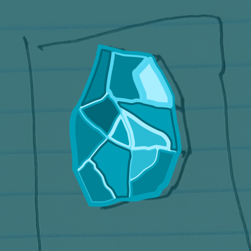

  

<h1 align="center">Apatite</h1>

Effortlessly open URLs during specific time intervals with Apatite.

## What is Apatite?

Apatite is a tool that opens a specific URL when in between certain timestamps. This can be useful for when you have a set schedule and open the same URL during a certain time period.

## How To Use

Refer to the [setup instructions](docs/SETUP.md).

## Known Issues

- Apatite currently does not work on a mobile filesystem. A hosted version has not been tested on mobile.

## Contributing

Currently no contributions are being accepted.
